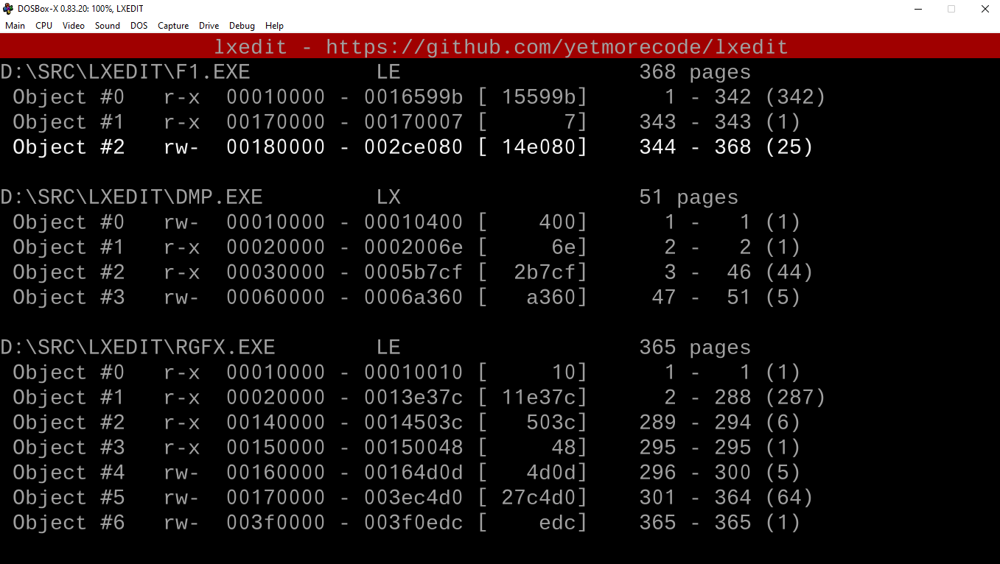

# LX/LE executable editor for DOS (WIP)

## Features

 * View LX/LE exeuctables (headers, objects, pages, fixups)
 * Change base address, permission or order of objects (WIP)
 * Merge objects from multiple executables into one exe (WIP)
 * Manually add and edit fixups (like "hooking" places) (WIP)
 * Edit page data with inline hex editor (WIP)

## Usage

 * Run `lxedit file1.exe file2.exe ...`
 * Arrow keys to navigate `up`, `down`, `left` and `right`
 * `e` to edit data
 * `m` to merge objects
 * `w` to write changes to a new exe file 
 * `q` to exit

## Development (in dosbox)
 * Install open watcom
 * Install pdcurses
 * Run wmake